# 
<h1 align="center">Welcome to Setting Up OpenShift Custer Using Code Ready Containers (CRC) on MacOS 👋</h1>
<p align="center">
  
  <a href="https://twitter.com/mfaisaltariq01" target="_blank">
    
  </a>
</p>

### **Downloading Packaged Containers**
------

Go to the [LINK](https://developers.redhat.com/products/codeready-containers) and Click on **Download CodeReady Containers**. It will route you to the login page. Login using your RedHat Credentials or you can signup for a new account and then login. 

Once LoggedIn click on the **macOS: Download (HyperKit)** link and it will download a tarball. Note that that the cluster will be setup on HyperKit which comes pre installed on macOS previous versions had an option to setup with VirtualBox as well.

A secret is also required to pull containers, the secret can also be downloaded from a link given on the same page. Click on the **Download Pull Secret** link to download the file. 

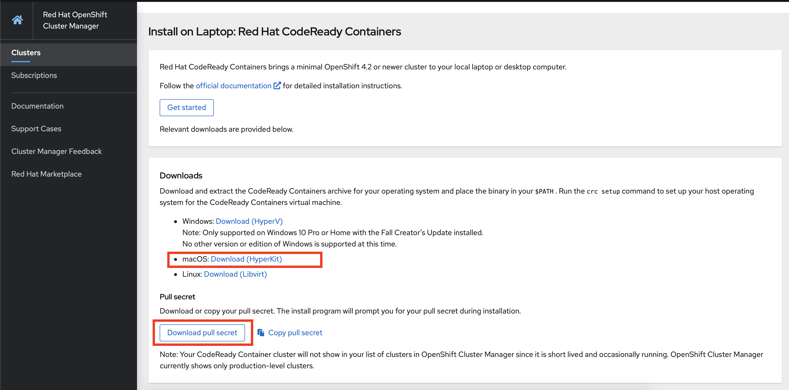

### **Setting up CRC and Configurations**
------
Once downloaded extract the tarball 

```
tar -xvf crc-macos-amd64.tar.xz
```

Move the **CRC** binary to a folder where you can directly access the command
```
sudo mv crc-macos-1.9.0-amd64/crc /usr/local/bin/
```

Run the command to verify that that crc binary is accessible globally.
```
crc --help
```
> Sometimes it might popup a message that says that it is from an unidentified developer. Allow execution from **Security and Privacy** section in the settings.

To setup CRC run the following command
```
crc setup
```

If the setup is successful you should see the following output.

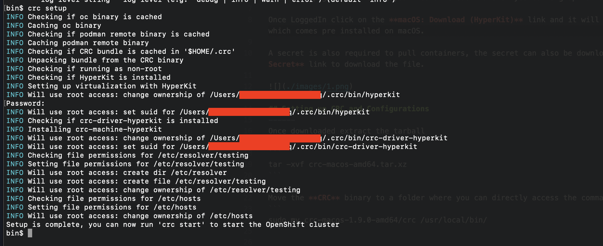


### **Starting the Cluster**
------

Run the `crc start -h` command to check out the different options to specify custom options for increased memory and cpu usage. I'll be using the default minimum requirements to run the cluster. While starting the cluster we'll have to provide the **Secret** that we downloaded previously.

```
crc start -p <path>/pull-secret 
```

Once started, a few instructions on how to setup environment and access the console will be presented on the terminal.
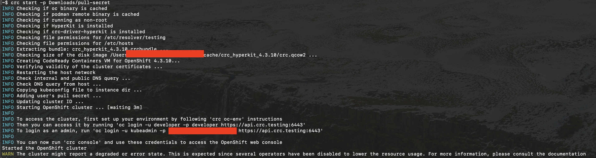

Run the following commands given in the instructions
```
crc oc-env
eval $(crc oc-env)
```

Now lets login to the cluster using the **developer** account. You can also use the admin account, the password can be found for the admin in the instructions printed on the terminal.

```
oc login -u developer -p developer https://api.crc.testing:6443
```
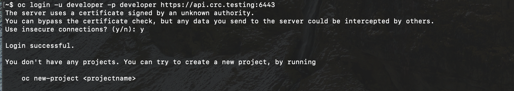


After logging into the cluster we can create projects from the CLI or the Web Console. To access the Web Console type in the `crc console` command to open it up in the web browser. Choose the admin account or developer account to login, provide username and password to login.
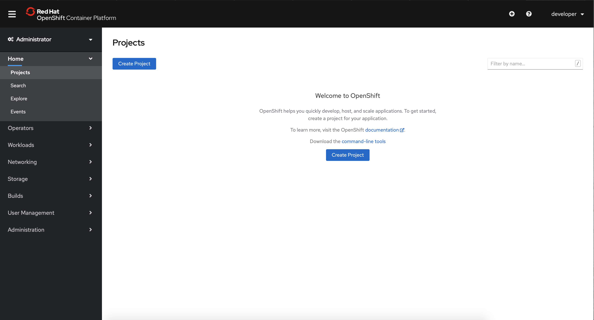

## **Creating a test project using a template (S2I)**
------

The test project can be setup by either using the **console** or the **cli**. Lets visit both of these methodologies.

### **Using Console**
------

The first step is to create a project. Make sure that the **Developer** tab is selected and click on **Project --> Create Project** in the main window.
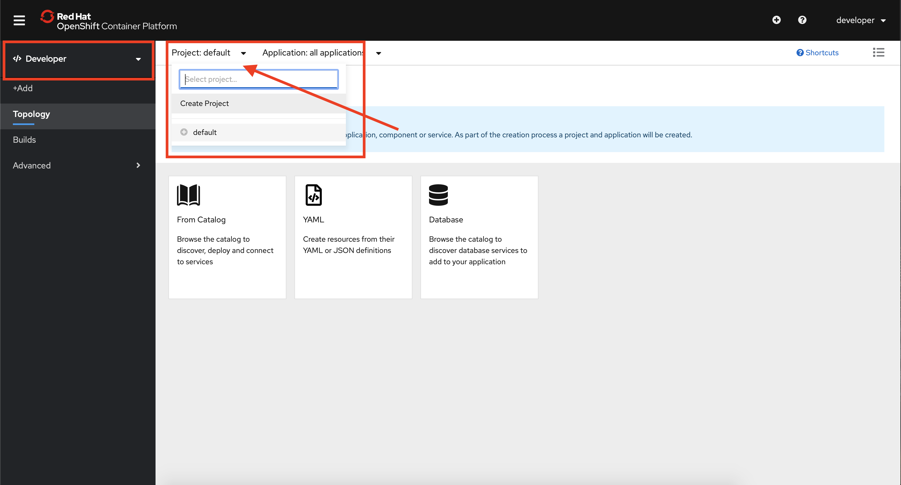

Name the project **test-project** and fill in the other fields. Click on **Create**.
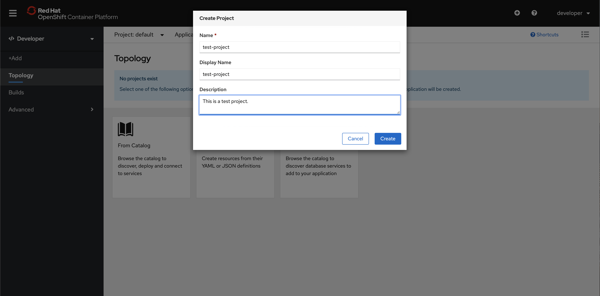

Click on the **Catalog** section and then the select the **Apache HTTP Server** from the items section. Click on **Instantiate Template** and note the **GitHub URL**, it will be used when we create the app using the CLI.
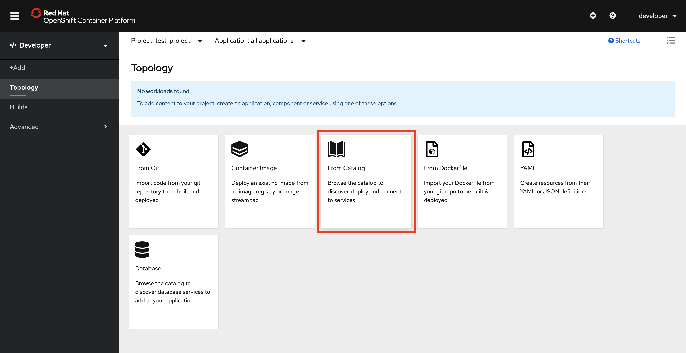

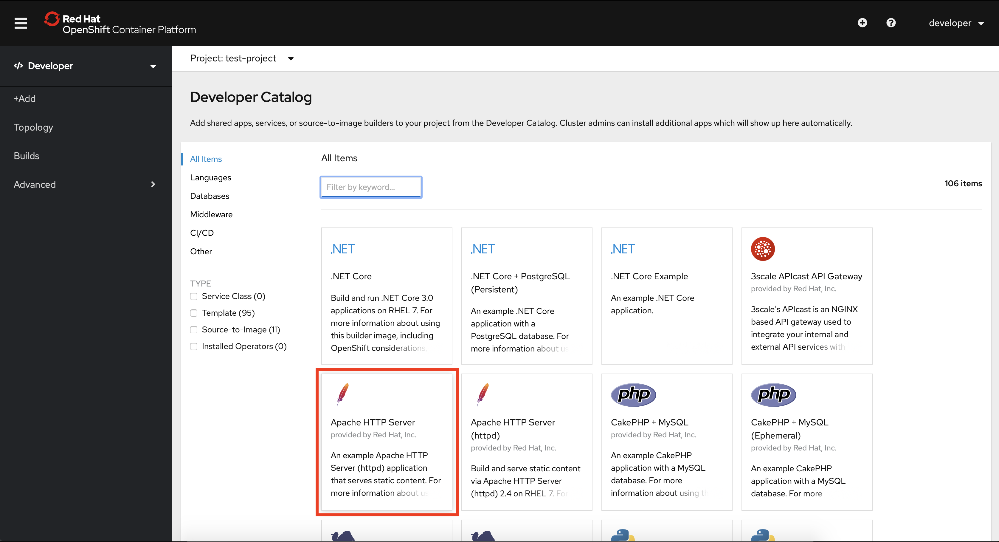

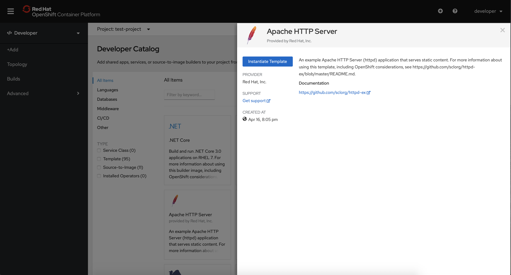

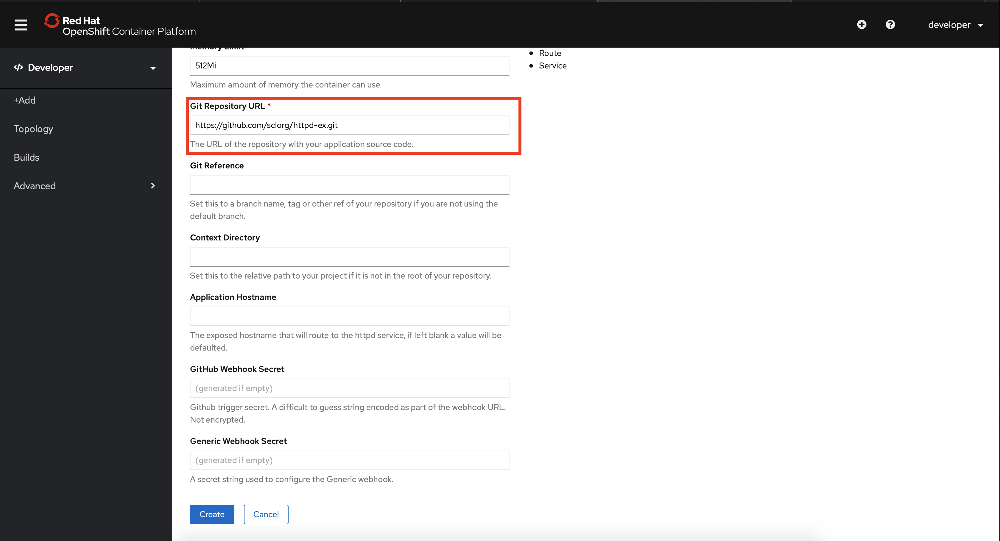

Wait for a few minutes, until the **Status** turns to **Ready**.

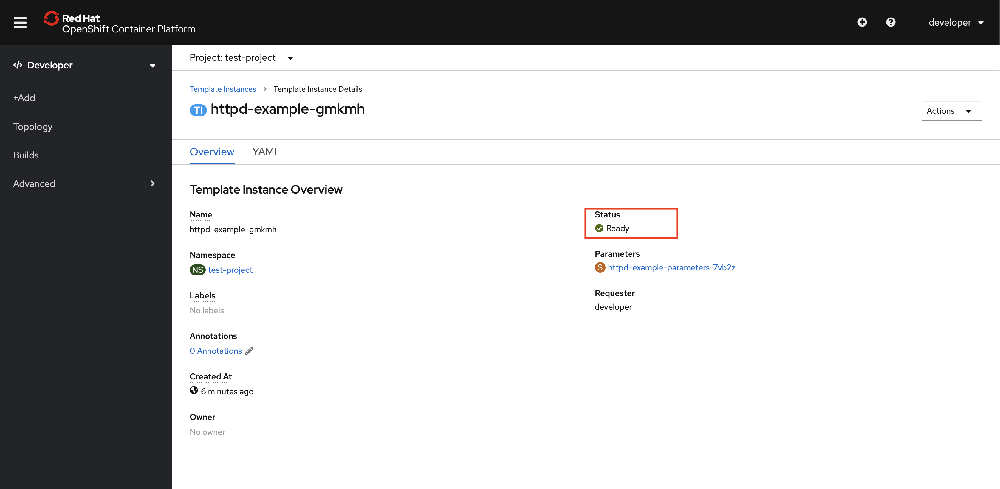

Select the **Topology** tab on the left and click on **Open URL** to visit the deployed Apache Server web page.

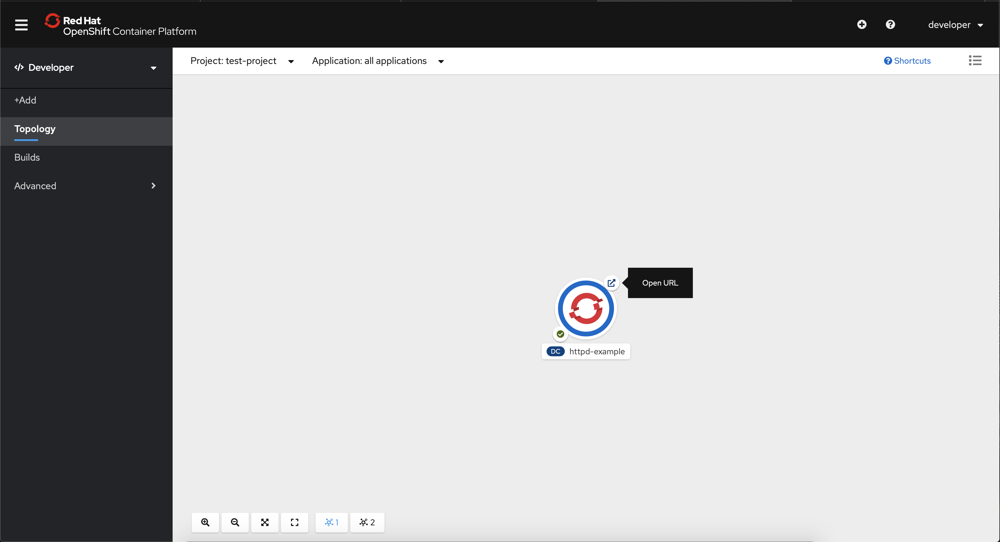


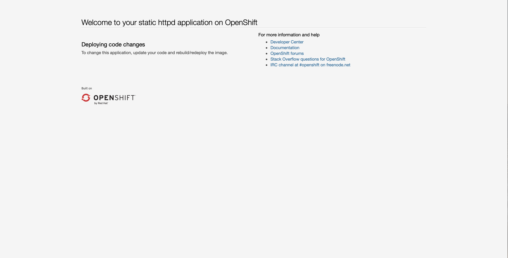

### **Using CLI**
------

## Resetting the Environment
Delete the application and project to reset the environment by running the following commands on the console.

```
oc delete all -l app=httpd-example
oc delete project test-project
```
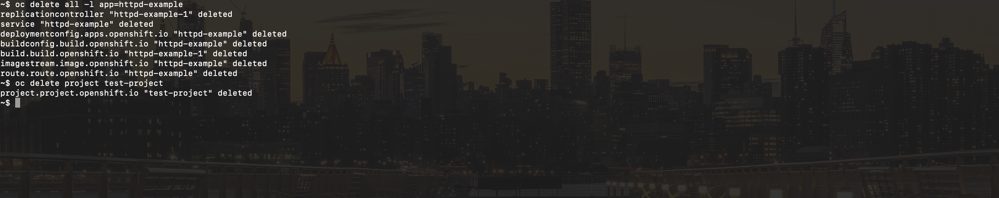

Create the project from the CLI by running the following command.

```
oc new-project test-project
```

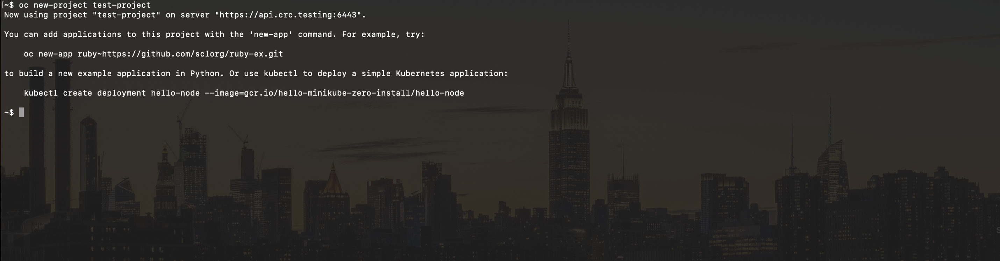

Now the application can be deployed using the **Github URL** that we have copied previously.

Clone the repository and move into the templates folder.

```
git clone https://github.com/sclorg/httpd-ex.git
cd httpd-ex/openshift/templates/
```

Run the create app command by providing the **template.json** as an applicaiton template.

```
oc new-app -f httpd.json
```


Wait for a few mintues until the deploment and build has successfully completed and the pod has been deployed. Check the status by running the `oc get all` command.

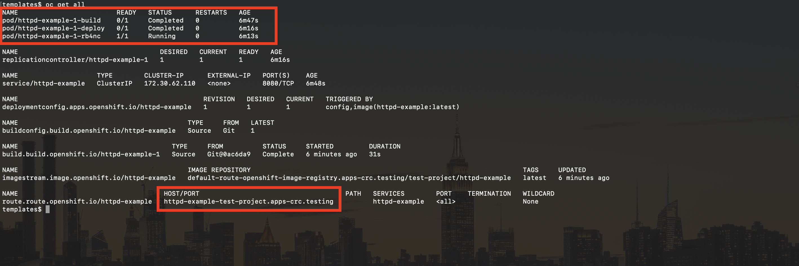

Copy the application URL from the routes section and open it up in the browser.

## Author

👤 **Muhammad Faisal Tariq**

<p>
  <a href="https://twitter.com/mfaisaltariq01" target="_blank">
    
  </a>
  </br>
  <a href="https://github.com/mfaisaltariq" target="_blank">
    
  </a>
  </br>
  <a href="https://linkedin.com/in/mfaisaltariq" target="_blank">
    
  </a>
  </br>
  <a href="https://www.youtube.com/c/DesktopDev_mfaisaltariq" target="_blank">
    
  </a>
</p>

## Show your support

Give a ⭐️ if this project helped you!


